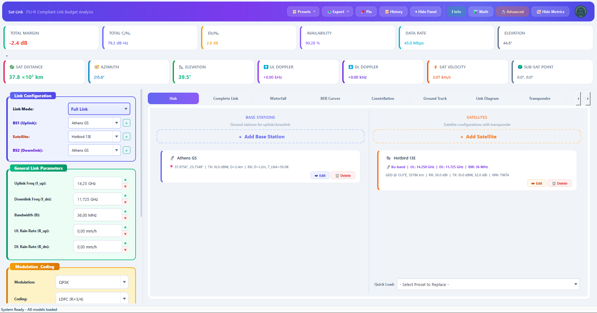
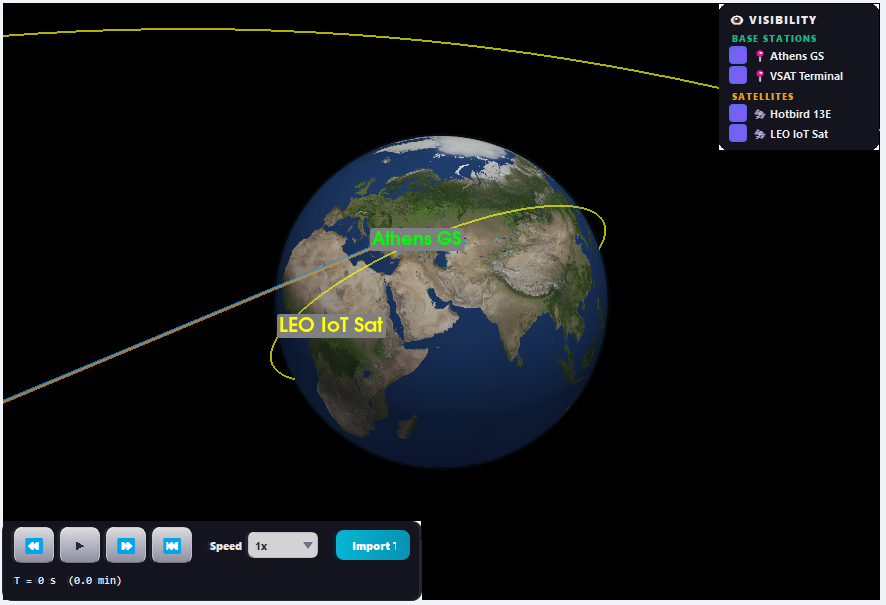
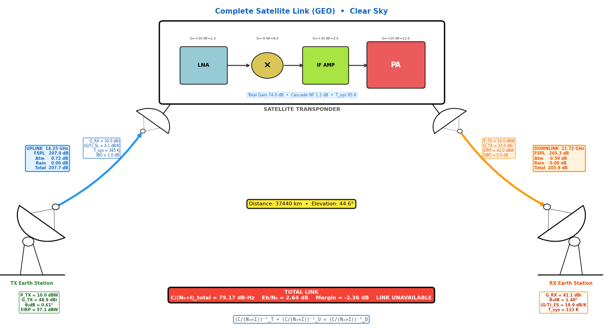
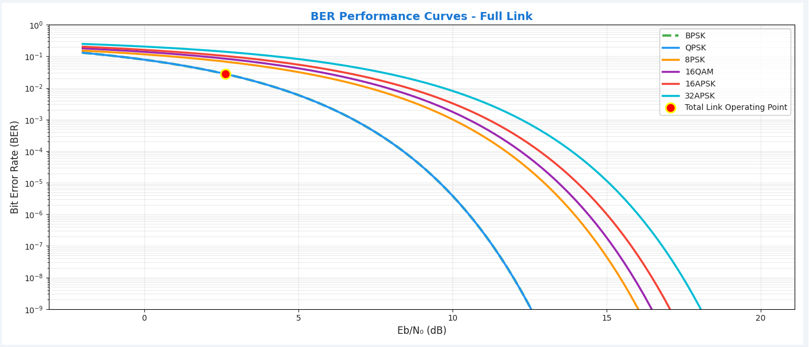
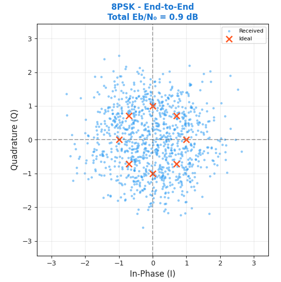

# Sat-Link

<p align="center">
  <b>An open-source, ITU-R-aligned satellite link-budget simulator for education, research, and early-stage mission trade studies.</b>
</p>

<p align="center">
  
  
  
  
  
  
</p>

<p align="center">
  
</p>

## Why Sat-Link Exists

Satellite communication students and early-stage system designers often move between static spreadsheets, closed commercial tools, and disconnected scripts. Sat-Link brings the whole chain into one inspectable desktop application: orbital geometry, propagation loss, uplink and downlink budgets, transponder behavior, modulation performance, weather effects, statistical analysis, and exportable reports.

The result is a simulator that makes link-budget physics visible. Change an orbit, aperture, frequency band, coding scheme, rain rate, HPA back-off, or ground-station location and immediately see the effect on `C/N0`, `Eb/N0`, BER, margin, Doppler, availability, and transponder operating point.

Sat-Link is designed for:

- graduate-level satellite communications teaching
- reproducible lab exercises and conference demonstrations
- preliminary GEO, LEO, MEO, and HEO link studies
- "what-if" trade-space exploration before detailed mission tooling
- licensed amateur-radio and educational satellite experimentation

## Conference Snapshot

| Capability | What Sat-Link Provides |
|---|---|
| End-to-end link budget | Uplink, downlink, and total `C/N0` using reciprocal carrier-to-noise combination |
| Standards-aligned propagation | FSPL, gaseous absorption, rain attenuation, cloud attenuation, scintillation, rain-height inputs |
| Transponder modeling | Friis cascade noise, LNA/Mixer/IF/PA chain, TWTA Saleh model, SSPA Rapp model, OBO and C/IM estimation |
| Orbit and geometry | LEO, MEO, GEO, HEO, slant range, elevation, azimuth, Doppler, propagation delay, ground tracks |
| Interactive UI | Hub, complete link, waterfall, BER, constellation, ground track, link diagram, transponder, optional 3D view |
| Advanced analysis | Scenario comparison, sweeps, availability, sensitivity, spectrum, Monte Carlo, fade dynamics, regulatory checks, interference, rain-fade simulator |
| Reproducibility | Python source, paper assets, validation scenarios, PDF/CSV export, Windows installer build scripts |

## Validated Against Reference Link Budgets

Sat-Link was validated against three independent textbook/standards-based reference scenarios. The simulator stayed within `0.30 dB` worst-case error in `C/N0`, with a mean absolute error of `0.23 dB`.

| Scenario | Reference `C/N0` | Sat-Link `C/N0` | Delta |
|---|---:|---:|---:|
| GEO / Ku-band, clear sky | 87.3 dB-Hz | 87.1 dB-Hz | -0.2 dB |
| LEO / S-band, clear sky | 73.1 dB-Hz | 73.3 dB-Hz | +0.2 dB |
| GEO / Ka-band, 25 mm/h rain | 78.5 dB-Hz | 78.2 dB-Hz | -0.3 dB |

Validation summary:

- Mean absolute error: `0.23 dB`
- RMSE: `0.24 dB`
- Maximum deviation: `0.30 dB`
- Rain coefficients cross-checked against ITU-R P.838-3 coefficient tables across 1 to 100 GHz
- Intended accuracy target: education and preliminary trade studies, not final regulatory filing or flight qualification

See the manuscript sources in [paper.tex](paper.tex), [final.tex](final.tex), and the compiled papers [paper.pdf](paper.pdf) / [final.pdf](final.pdf).

## Visual Workflows

### 3D Orbit and Ground Infrastructure

<p align="center">
  
</p>

The optional PyVista/VTK view renders Earth, ground stations, satellites, link lines, orbit traces, playback controls, visibility toggles, and TLE-imported spacecraft.

### Link Diagram With Transponder Chain

<p align="center">
  
</p>

The link diagram exposes the RF story in one view: uplink path loss, satellite transponder cascade, downlink path loss, weather effects, geometry, and end-to-end link status.

### BER and Constellation Diagnostics

<p align="center">
  
</p>

<p align="center">
  
</p>

Sat-Link plots BER curves for BPSK, QPSK, 8PSK, 16-QAM, 64-QAM, 16-APSK, and 32-APSK, then overlays the current operating point. The constellation view renders ideal and noisy IQ symbols using the current link state.

## Implemented Models

| Area | Implementation |
|---|---|
| Geometry | Slant range, elevation, azimuth, polarization angle, propagation delay, Doppler |
| Free-space loss | ITU-R P.525 style FSPL formulation |
| Rain attenuation | ITU-R P.618 / P.838-3 coefficient interpolation with polarization tilt and effective path reduction |
| Gaseous loss | ITU-R P.676-style oxygen and water-vapor attenuation |
| Cloud and fog | ITU-R P.840-style liquid-water attenuation |
| Scintillation | ITU-R P.618-style tropospheric scintillation estimate |
| Antenna gain | Aperture gain and beamwidth calculations with efficiency and pointing loss |
| Noise | System temperature, antenna temperature, receiver noise temperature, `G/T` |
| Modulation | BPSK, QPSK, 8PSK, 16-QAM, 16-APSK, 32-APSK, 64-QAM BER curves |
| Coding | Uncoded, convolutional, Turbo, and LDPC coding-rate/gain presets |
| Transponder | Four-stage bent-pipe chain, Friis cascade NF, Saleh TWTA, Rapp SSPA, Linearized mode |
| Statistics | Monte Carlo availability, rain samples, confidence intervals, fade time series |
| Regulation/interference | PFD per 4 kHz, ITU-style limits, EIRP density masks, adjacent-satellite interference |

## Computation Chain

Sat-Link keeps the calculation path explicit instead of hiding it inside a spreadsheet cell:

```text
1. Geometry
   ground station + satellite position -> slant range, elevation, azimuth

2. Uplink
   GS antenna gain -> GS EIRP -> FSPL -> atmospheric loss -> satellite G/T -> uplink C/N0

3. Transponder
   LNA/Mixer/IF/PA Friis cascade -> cascade NF -> HPA OBO -> C/IM contribution

4. Downlink
   satellite EIRP -> FSPL -> atmospheric loss -> GS G/T -> downlink C/N0

5. End-to-end
   reciprocal C/N0 combination -> C/N -> Eb/N0 -> link margin -> BER
```

Core formulas exposed through the model:

```text
FSPL(dB)  = 20 log10(d_km) + 20 log10(f_GHz) + 92.45
C/N0      = EIRP - L_path + G/T - k
C/N       = C/N0 - 10 log10(B)
Eb/N0     = C/N0 - 10 log10(R_b)
Margin    = Eb/N0 - Required Eb/N0
```

For the complete link, uplink, downlink, and intermodulation terms are combined in reciprocal form:

```text
1 / (C/N0_total) = 1 / (C/N0_uplink) + 1 / (C/N0_downlink) + 1 / (C/IM0)
```

## Application Surface

Sat-Link is a desktop laboratory, not a single plot.

| Workspace | Purpose |
|---|---|
| Hub | Manage base stations and satellites, including presets such as Athens GS, Hotbird 13E, Astra 19.2E, LEO broadband, and MEO navigation |
| Complete Link | Inspect uplink, downlink, geometry, losses, `C/N0`, `Eb/N0`, BER, and total margin |
| Waterfall | Visual decomposition of each major budget term |
| BER Curves | Compare modulation performance and current operating point |
| Constellation | View IQ symbol spread under the active link quality |
| Ground Track | Animate orbit tracks, footprint, sub-satellite point, and ground-station visibility |
| Link Diagram | Show the complete animated satellite link and weather state |
| Transponder | Inspect RF cascade, HPA transfer curve, OBO, C/IM, AM/PM, and noise contribution |
| 3D View | Optional PyVista globe with orbit playback, visibility controls, link lines, and TLE import |

The Advanced dialog adds 13 analysis panels:

`Scenarios`, `Elevation`, `Availability`, `Band Compare`, `Sensitivity`, `Time Series`, `Coverage`, `Spectrum`, `Monte Carlo`, `Fade Dynamics`, `Regulatory`, `Interference`, and `Rain Simulator`.

## Repository Structure

```text
Sat-Link/
|-- main_advanced.py              # Main PyQt5 application
|-- models/
|   |-- link_budget.py            # ITU-R-aligned link-budget engine
|   |-- orbit.py                  # Keplerian/J2 orbit propagation, Doppler, TLE parsing
|   |-- transponder.py            # Bent-pipe transponder, Friis cascade, Saleh/Rapp HPA models
|   |-- modulation.py             # BER and constellation support
|   |-- constants.py              # RF bands, orbit presets, ITU data tables, regulatory masks
|   |-- satellite.py              # Satellite configuration presets
|   `-- base_station.py           # Ground-station presets
|-- gui/
|   |-- visualizations/           # Link, BER, constellation, ground-track, transponder, 3D tabs
|   |-- advanced_analysis/        # 13-panel advanced analysis dialog
|   |-- hub/                      # Base-station and satellite management
|   |-- dialogs/                  # Info, history, math details
|   `-- utils/                    # Export, presets, save/load, app paths
|-- figures/                      # Paper and README figures
|-- installer/                    # Inno Setup installer definition
|-- release/                      # Built Windows installer output
|-- paper.tex / final.tex         # Manuscript sources
|-- paper.pdf / final.pdf         # Compiled manuscript artifacts
|-- build_installer.ps1           # PyInstaller + Inno Setup build pipeline
|-- install.ps1                   # Windows dependency setup
|-- run_advanced.ps1              # Windows launcher
`-- requirements.txt              # Python dependencies
```

## Quick Start

### Option 1: Windows Installer

Use the prebuilt installer if it is included in the repository release:

```text
release/SatLink-Setup-3.0.0.exe
```

### Option 2: Windows PowerShell

```powershell
powershell -ExecutionPolicy Bypass -File .\install.ps1
powershell -ExecutionPolicy Bypass -File .\run_advanced.ps1
```

### Option 3: Manual Python Environment

```powershell
python -m venv venv
.\venv\Scripts\Activate.ps1
python -m pip install --upgrade pip
python -m pip install -r requirements.txt
python main_advanced.py
```

For Linux or macOS, create a Python 3.9+ virtual environment, install `requirements.txt`, and run `python main_advanced.py`. The GUI and 3D stack depend on local Qt/OpenGL support.

## Requirements

Core stack:

- Python 3.9+
- PyQt5 and PyQtGraph
- NumPy, SciPy, Pandas, Matplotlib, Seaborn
- PyVista and PyVistaQt for optional 3D rendering
- Skyfield, SGP4, PyOrbital, and scikit-rf support libraries
- ReportLab for report generation support

Install everything with:

```powershell
python -m pip install -r requirements.txt
```

## Build the Windows Installer

Requirements:

- Python 3.9+
- Inno Setup 6, with `ISCC.exe` available

Build command:

```powershell
powershell -ExecutionPolicy Bypass -File .\build_installer.ps1 -Version 3.0.0
```

Useful build flags:

```powershell
.\build_installer.ps1 -Clean
.\build_installer.ps1 -SkipDependencies
.\build_installer.ps1 -SkipExeBuild
.\build_installer.ps1 -SkipInstaller
```

Outputs:

```text
dist/Sat-Link/Sat-Link.exe
release/SatLink-Setup-<version>.exe
```

## Example Study Ideas

| Study | What to change | What to observe |
|---|---|---|
| Ku-band GEO DTH link | Downlink frequency, dish diameter, rain rate | Margin, BER, receiver `G/T`, rain loss |
| LEO broadband pass | Orbit type, altitude, ground station | Doppler, visibility, slant range, ground track |
| Ka-band rain stress test | Rain rate, water vapor, cloud liquid water | Availability, fade depth, link outage |
| HPA linearity trade | HPA type, IBO, carrier count | OBO, C/IM, AM/PM, total `C/N0` |
| Aperture vs. power | Antenna size and TX power sweeps | Which design recovers margin more efficiently |
| Regulatory sanity check | EIRP, bandwidth, frequency, elevation | PFD margin and mask behavior |

## Reproducibility Notes

The deterministic core is the validated portion of the simulator: geometry, FSPL, atmospheric losses, transponder cascade noise, and end-to-end `C/N0` composition. Some advanced panels intentionally use reduced-order or heuristic relations to remain interactive, especially synthetic time-series generation and empirical IBO-to-C/IM behavior.

Sat-Link is appropriate for transparent education, demonstrations, and preliminary studies. It is not a replacement for certified regulatory filing tools, high-fidelity propagation campaigns, measured climate datasets, or flight-qualification mission analysis.

## Citation

If Sat-Link supports your teaching, research, or conference work, please cite the project:

```bibtex
@software{satlink2026,
  title        = {Sat-Link: An Open-Source Simulator for ITU-R-Compliant Satellite Link-Budget Analysis},
  year         = {2026},
  publisher    = {Sat-Link Team},
  note         = {Open-source desktop simulator for satellite link-budget education and preliminary trade studies}
}
```

## License

This project is intended for educational and professional research use under the MIT License.
